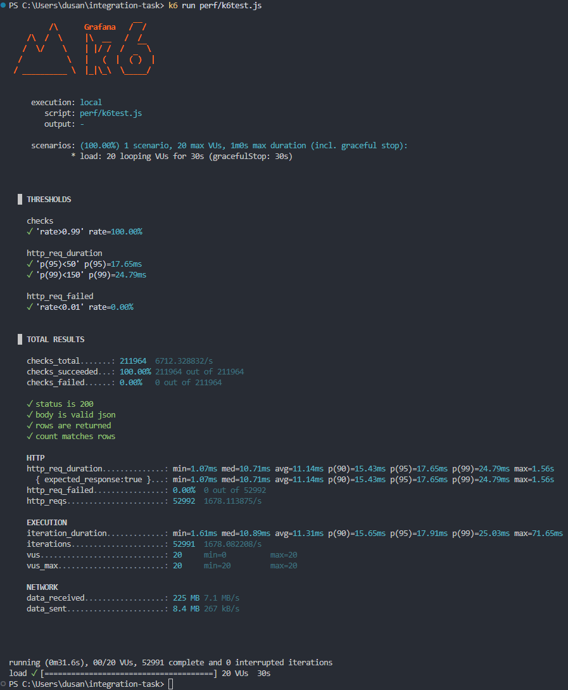
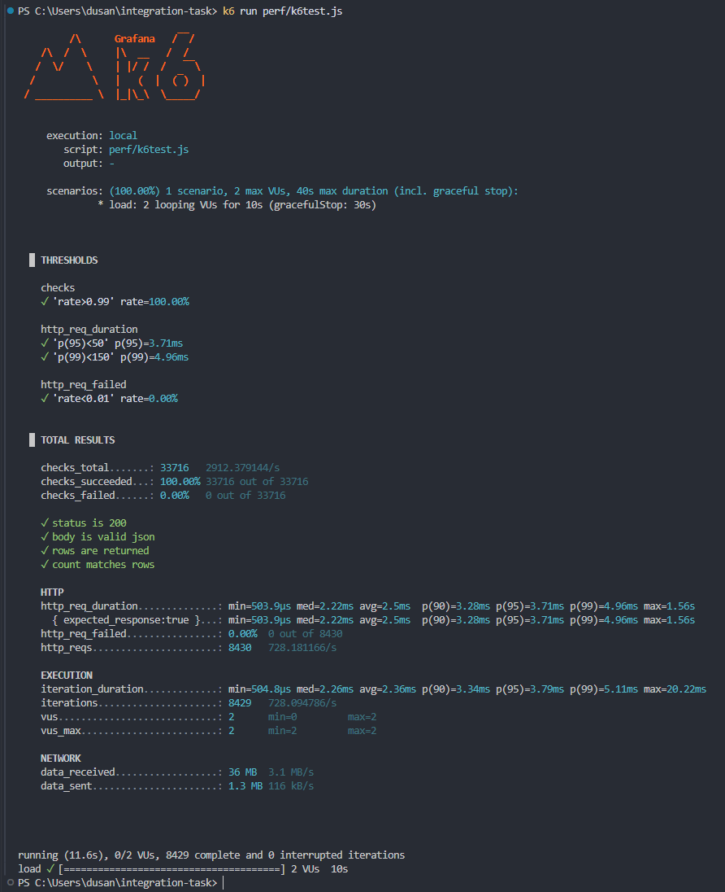
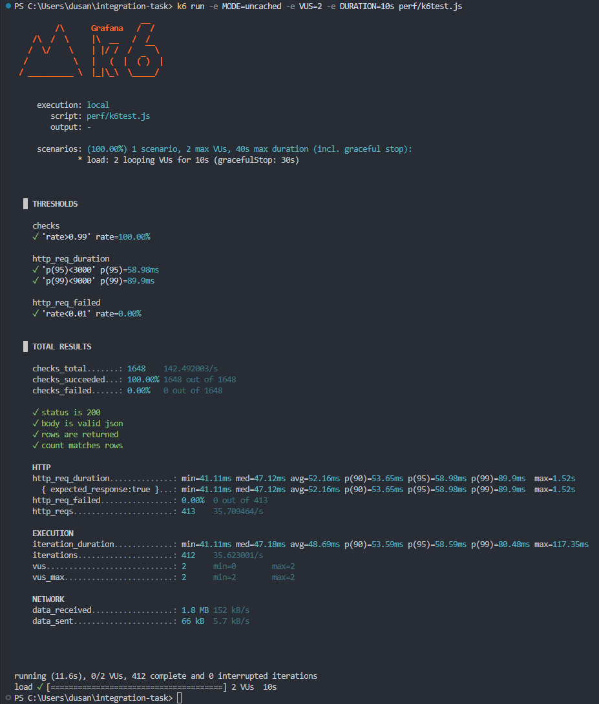

### Swagger UI

https://integrationtaskhotels-ahgzhthjayhpezaf.polandcentral-01.azurewebsites.net/api/swagger/ui

### Bearer AccessToken `leeBHB+PURPYQ4mFc6pl8bKlYbAt+OK5otWZbDEeAuQ=`

## Test machine

| | |
|---|---|
| PC | Custom desktop, Gigabyte B560M AORUS ELITE |
| CPU | Intel Core i5-10400F @ 2.90 GHz, 6 cores / 12 threads |
| RAM | 32 GB, 4 x 8 GB Kingston KF2666C16D4/8G @ 2666 MT/s |
| Storage | Kingston KC3000 1 TB NVMe SSD (SKC3000S1024G), holds C: and the project |
| OS | Windows 11, build 26200 |
| .NET | 10.0.400 SDK, function targets net9.0 |
| Azure Functions Core Tools | 4.3.0 |
| k6 | v2.2.0 |

## Results

### Cached, 20 VUs for 30s

52 992 requests at 1678/s, 225 MB received. p95 **17.65 ms** against a 50 ms budget,
p99 24.79 ms. No failures, all 211 964 checks passed.

### Cached, 2 VUs for 10s

8430 requests at 728/s. p95 **3.71 ms**, p99 4.96 ms, median 2.22 ms.

### Uncached, 2 VUs for 10s

413 requests at 35.7/s, every one a live Dataverse query. p95 **58.98 ms**, p99 89.9 ms,
median 47.12 ms.

